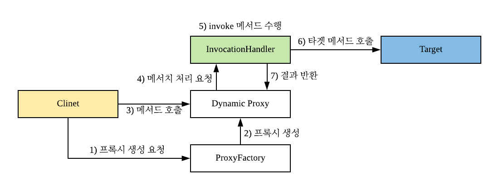
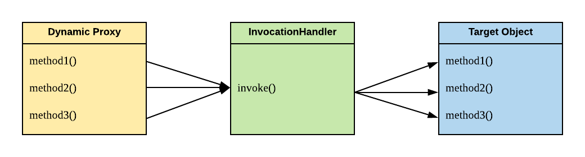
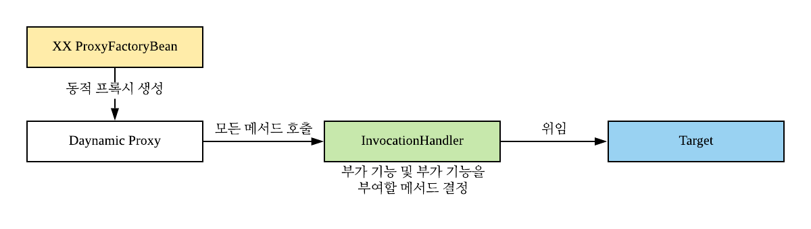
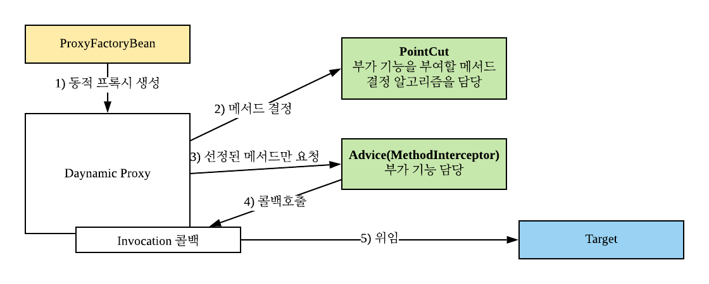
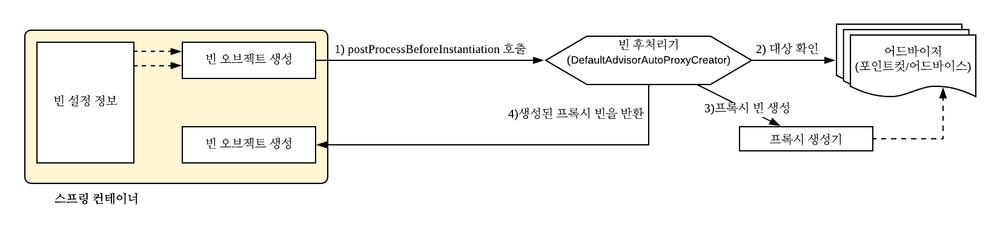
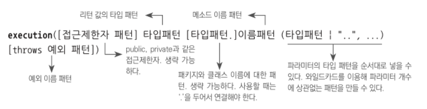

# 1-6장 AOP

### 다이나믹 프록시와 팩토리 빈
- 단순히 확장성을 고려한다면 DI를 이용하면 되고, 여러 구현 기술을 일관된 방식으로 접근하기 위해선 PSA를 활용하면 된다.
- 하지만 이를 활용하더라도, 기술 사용을 위한 부가 기능 코드는 비즈니스 로직과 함께 존재한다. (데이터 엑세스 기술에선 트랜잭션이 대표적인 예다.)
- 비즈니스 로직과 부가 기능 코드를 분리하기 위한 가장 좋은 기법은 프록시 기법을 활용하는 것이다.

> 클라이언트와 비즈니스 로직 사이의 프록시를 두고 부가 기능을 프록시에서 덧 붙이도록 할 수 있다. (데코레이터 패턴)

### 프록시의 두가지 목적
- **클라이언트가 타깃에 접근하는 방법을 제어하는 것(프록시 패턴)ㅋ**  
    - 프록시 패턴은 접근 제어뿐만 아니라 지연 초기화에 유용하다.
    - 클라이언트는 프록시를 참조하기 때문에 실제 사용시점 까지 객체 생성을 미룰 수 있다.
- **타깃에 부가적이 기능을 동적으로 부여해주는 것(데코레이터 패턴)**

> 프록시 패턴은 프록시의 일부분이다.

### 동적(다이나믹) 프록시
- 프록시를 직접 만들지 않고 리플렉션을 통해 런타임에 필요한 프록시를 생성하는 기법으로 기존 JDK에서 제공해준다.
- 동적 프록시를 활용하면 기존 프록시의 단점을 해결할 수 있다.
- **일반 프록시 기법의 단점**
    - 프록시를 적용하지 않을 메서드들도 전부 하나하나 다 포워딩해줘야 하므로 효율적이지 못하다.
    - 모든 메서드에 동일한 프록시를 적용하고 싶더라도 하나하나 다 적용해줘야 하므로 효율적이지 못하다.
    
#### 동적 프록시 동작원리




 
#### 동적 프록시 InvocationHandler
- 동적 프록시는 InvocationHandler의 invoke를 이용하여 리플렉션을 통해 타깃 메서드를 호출할 수 있다.
- 이 invoke 메서드에서 프록시 부가 기능을 추가할 수 있다.
    - 보통 이걸 위해선 우리가 구현한 InvocationHandler에서 실제 대상이 될 target Object를 참조하고 있고 method.invoke할 때 target object를 이용하게 하면 된다.
      
### 팩토리 빈
- 동적 프록시는 Proxy.newProxyInstance로 생성하기 때문에 빈으로 등록하기 힘들다.
- 이렇게 static 메서드로만 객체를 생성할 수 있을땐 FacotryBean을 활용하면 빈으로 등록할 수 있다.

```java
public class TxProxyFactoryBean implements FactoryBean<Object> {

    private Object target;
    private PlatformTransactionManager transactionManager;
    private Class<?> serviceInterface;

    public TxProxyFactoryBean(Object target, PlatformTransactionManager transactionManager, Class<?> serviceInterface) {
        this.target = target;
        this.transactionManager = transactionManager;
        this.serviceInterface = serviceInterface;
    }
    
    // 생성자에서 주입된 정보들을 이용하여 빈으로 등록할 동적 프록시를 생성할 수 있다.
    @Override
    public Object getObject() throws Exception {
        // 생성자에서 주입받은 target object, transactionmanager를 이용하여 TransactionHandler를 생성해 빈으로 등록한다.  
        TransactionHandler txHandler = new TransactionHandler(target, transactionManager);
        return Proxy.newProxyInstance(getClass().getClassLoader(), new Class[]{serviceInterface}, txHandler);
    }

    @Override
    public Class<?> getObjectType() {
        return serviceInterface;
    }

    @Override
    public boolean isSingleton() {
        return false;
    }
}
```

### 동적 프록시의 한계
- 동적 프록시라도 팩토리 빈을 이용하여 빈으로 등록할 수 있고 재사용성도 뛰어나다. 하지만 한계점이 존재한다.
- 1) 각 서비스별로 따로따로 팩토리 빈을 이용한 빈 등록이 필요하다.
- 2) InvocationHandler는 공통 사용이 가능하나 빈 등록마다 새롭게 생성되어야 한다.
- 3) 부가 기능이 하나가 아닌 여러개라면 동적 프록시로는 구현이 매우 까다로워 진다.

### 프록시의 장점
- 프록시 기법 중 데코레이터 패턴을 활용하면 런타임에 부가 기능을 추가할 수 있음.

### 일반 프록시 < 동적 프록시
- 일반 프록시는 프록시 타깃 인터페이스의 모든 메서드를 구현하여 위임이 필요하지만 동적 프록시는 InvocationHandler 하나만 구현하면 된다.
- 일반 프록시는 동일한 부가 기능이더라도 각 메서드별로 하나하나 추가해줘야 하지만 동적 프록시는 모둔 메서드가 InvocationHandler를 이용한다.
- 동적 프록시는 스프링 팩토리 빈을 활용하면 빈 등록시에도 유용하게 사용할 수 있다. (@Configuration에서 @Bean을 이용해 생성하면 Proxy.newProxyInstance로도 가능할 것 같다.)

### 스프링의 프록시 팩토리 빈
```java
static class UppercaseAdvice implements MethodInterceptor {
    @Override
    public Object invoke(MethodInvocation invocation) throws Throwable {
        String ret = (String) invocation.proceed();
        return ret.toUpperCase();
    }
}

@Test
void proxyFactoryBean() throws Exception{
    ProxyFactoryBean pfBean = new ProxyFactoryBean();
    pfBean.setTarget(new HelloTarget());
    pfBean.addAdvice(new UppercaseAdvice());

    Hello proxyHello = (Hello) pfBean.getObject();
    assertThat(proxyHello.sayHello("Dexter")).isEqualTo("HELLO DEXTER");
    assertThat(proxyHello.sayHi("Dexter")).isEqualTo("HI DEXTER");
    // proxyHello.print("Dexter"); 해당 기능을 호출하면 NPE가 발생할 것이다.
}
```

- 스프링은 일관된 방법으로 프록시를 만들 수 있는 추상화 레이어인 ProxyFactoryBean을 제공한다.
- MethodInterceptor를 구현하여 ProxyFactoryBean에 addAdvice해주고, addTarget을 통해 실제 타깃 오브젝트를 추가해준다.
- MethodInterceptor는 메서드 파라미터로 타깃 메서드를 실행할 수 있는 콜백 정보(MethodInvocation.proceed())를 제공하므로 MethodInterceptor에서 타깃 오브젝트를 몰라도 된다.
    - 프록시에서 타깃 오브젝트를 몰라도 되기 때문에 싱글톤으로 만들어 사용하더라도 문제가 발생하지 않는다.
    - 타깃 오브젝트에서 실제 프록시의 추가 기을 부여할 메서드는 포인트 컷을 통해 구별할 수 있다.

### 어드바이스: 타깃이 필요 없는 순수한 부가 기능
- MethodInterceptor는 순수한 부가 기능만 지원하기 때문에 일종의 템플릿 처럼 동작한다고 보면 된다.
- 그러므로 싱글톤으로 만들어 재사용이 가능한 것이다. 그리고 addAdvice로 어드바이스를 추가하는 개념이므로 여러개의 어드바이스를 추가할 수 있다.

### 포인트컷: 부가기능 적용 대상 메서드 선정 방법
- 프록시의 핵심은 부가기능이에 있기 때문에 부가기능을 적용할 대상은 부가기능과 분리하는게 좋다.
- **메서드를 선정하는 일도 일종의 교환 가능한 알고리즘이므로 전략 패턴을 적용할 수 있다.**

```java
@Test
void pointcutAdvisor() throws Exception{
    ProxyFactoryBean pfBean = new ProxyFactoryBean();
    pfBean.setTarget(new HelloTarget());

    NameMatchMethodPointcut pointcut = new NameMatchMethodPointcut();
    pointcut.setMappedName("sayH*");

    pfBean.addAdvisor(new DefaultPointcutAdvisor(pointcut, new UppercaseAdvice()));

    Hello proxyHello = (Hello) pfBean.getObject();
    assertThat(proxyHello.sayHello("Dexter")).isEqualTo("HELLO DEXTER");
    assertThat(proxyHello.sayHi("Dexter")).isEqualTo("HI DEXTER");
    proxyHello.print("Dexter");
}
```
- 위와 같이 어드바이스와 포인트컷을 묶은 오브젝트를 **어드바이저**라고 하며 해당 어드바이저를 등록하여 원하는 메서드에만 부가 기능을 추가할 수 있다.
- **포인트컷과 어드바이스는 각각 독립적이기 때문에 재사용이 가능하고, 이 둘을 결합한 어드바이저 또한 재사용이 가능하다.**

### InvocationHandler vs MethodInterceptor + Pointcut
#### InvocationHandler를 이용한 동적 프록시 동작 원리


#### MethodInterceptor와 Pointcut을 활용한 동적 프록시 동작 원리

- InvocationHandler의 경우 내부에서 타깃 오브젝트를 가지고 있고 해당 타깃 오브젝트를 직접 호출한다.
- 하지만 Advice인 MethodInterceptor는 내부에 타깃 오브젝트에 대한 참조를 가지고 있지 않다. 메서드 파라미터인 MethodInvocation을 통해 콜백을 호출하여 타깃 오브젝트의 메서드를 호출하도록 한다.
- **그러므로 Advice는 일종의 템플릿이되고, Invocation callback을 활용하여 타깃 오브젝트를 호출하므로 전형적인 템블릿 / 콜백 구조가 된다.**
- Advice는 템플릿이므로 재사용이 가능하므로 빈으로 등록도 가능해지고, 프록시로부터 어드바이스와 포인트컷을 독립시켜 DI 가능하게 하므로 유연하게 어드바이스와 포인트컷을 변경할 수 있게 된다.
    - 객체지향 원리를 충실히 지켰기 때문에 ProxyFactoryBean을 변경하지 않으면서 기능을 자유롭게 확장 가능할 수 있게 되었다. 

### 반복적인 ProxyFactoryBean 제거(DefaultAdvisorAutoProxyCreator)
- 빈 PostProcessor중 하나인 DefaultAdvisorAutoProxyCreator는 말 그대로 Advisor를 이용한 자동 프록시 생성기이다.
- DefaultAdvisorAutoProxyCreator는 빈으로 등록된 어드바이저들을 찾아서 프록시 대상을 찾아준다.
- 빈 PorstProcessor에 등록해놓으면 빈 오브젝트가 생성될 때마다 빈 후처리기에게 보내서 후처리 작업을 요청한다.
    - 빈 후처리기는 빈 프로퍼티를 강제로 수정할 수도있고 빈 오브젝트 자체를 바꿔치기할 수 있다.
    - 그러므로 스프링이 설정을 참고하여 새로운 프록시 빈으로 등록시키는게 가능한 것이다.

#### BeanPost 프로세서에 의해 프록시가 생성되는 원

- 빈이 만들어 질때마다 빈 후처리기에서 포인트컷을 통해 대상을 확인하고 타깃이 맞다면 프록시 생성기를 통해 프록시를 생성하여 기존 빈과 연결한 후 기존 빈 오브젝트 대신 프록시 빈을 컨테이너에게 돌려준다.

### 포인트컷 표현식
- AspectJExpressionPointcut 클래스를 이용하면 포인트컷 표현식을 사용할 수 있다.
    - 이 클래스는 클래스와 메서드 선정 알고리즘을 포인트컷 표현식을 이용해 한번에 지정할 수 있게 해준다.


- \[\]는 생략이 가능하다.
```java
System.out.println(Target.class.getMethod("minus", int.class, int.class));

// 출력
public int ch6.step7.Target.minus(int,int) throws java.lang.RuntimeException
```
- 반환 타입은 생략 불가능하며 모든 타입을 허용하기 위해선 *를 붙인다.
- 메서드명 이전까진 클래스 타입 패턴을 나타내며 생략 가능하다.
- 메서드명은 반드시 적어야 한다. 모든 타입은 *를 붙인다.
- 타입 패턴은 생략한다면 점점(..)을 붙인다.


### 부가기능의 모듈화(AOP)
- 트랜잭션과 같은 부가기능은 독립적으로 분리할 수 없다. 
- 말 그대로 부가되는 기능이기 때문에 부가기능을 적용할 타깃이 필요하기 때문이다.
- 이러한 부가기능들은 프록시를 통해 효율적으로 적용할 수 있다. 허나 이런 부가기능들은 많은 곳에서 사용하므로 중복이 발생하기 쉽다.
- 하지만 일반 프록시 기법이나 동적 프록시는 단점들이 많이 존재한다.
- 그래서 스프링은 빈 후처리기를 통한 자동 프록시 생성과 어드바이저를 활용하여 부가기능을 모듈화하여 실제 타깃 코드에 변경없이 효율적으로 적용할 수 있게 하였다.

### AOP: Aspect Oriented Programming
- 부가기능을 모듈화한 것을 일반 오브젝트와는 다르게 **애스팩트**라고 불렀다.
- 애스펙트는 애플리케이션의 핵심 기능을 담고있진 않지만, 애플리케이션의 핵심 기능에 부가 기능을 제공할 수 있는 특별한 모듈이다.
- **AOP란 애플리케이션에서 핵심적인 기능과 부가적인 기능을 분리해 애스팩트라는 별도의 모듈로 만들어서 설계하고 개발하는 것이다.**
    - 애스팩트를 분리하여 관심사를 분리하였기 때문에 객체지향적인 가치를 지킬 수 있다.

### 선언적 트랜잭션과 programmatic transaction
- 선언적 트랜잭션은 AOP를 이용해 트랜잭션의 부가 기능을 분리하고 원하는 속성을 따로 지정하는 것
- 프로그램에 의한 트랜잭션(programmatic transaction)은 트랜잭션 관련 코드를 직접 작성하는 것

### AOP 적용 기술
#### 1) 프록시를 이용한 AOP
- 스프링은 기본적으로 프록시를 활용한 AOP를 제공한다. 프록시를 이용한 기법은 메서드에서 대해서만 AOP를 적용할 수 있기 때문에 AOP를 적용할 수 있는 조인포인트는 **메서드가 전부이다.**
- 프록시를 이용한 기법은 실제 내부적으로 프록시 오브젝트를 만들어 사용하여 위임하는 방식을 취하므로 동일 객체 내부의 메서드를 호출하는 건 AOP를 적용할 수 없다.

#### 2) 바이트코드 조작을 통한 AOP
- AOP 기술의 원조인 AspectJ가 사용하는 기법으로 바이트 코드를 조작하여 실제 컴파일된 클래스 파일을 수정하거나, 클래스가 JVM에 로딩될 때 바이트코드를 조작하는 방법을 사용한다.
- 이 방식을 활용하면 메서드 뿐만 아니라 다양한 곳에 AOP를 적용할 수 있다. 그리고 클래스 자체를 수정하기 때문에 동일 객체 내부에서 메서드를 호출하더라도 AOP를 적용할 수 있다.

### AOP 용어
- 타깃
    - 부가기능을 부여할 대상
- 어드바이스
    - 부가기능을 담고 있는 모듈로 오브젝트로 정의할 수도 있지만 메서드 레벨(@AspectJ활용)로 정의할 수도 있다.
- 조인 포인트
    - 어드바이스가 적용될 위치로 프록시를 이용한 AOP는 오직 메서드만 존재한다.
- 포인트컷
    - 어드바이스를 적용할 조인 포인트를 결정하는 모듈
- 프록시
    - 클라이언트와 타깃 사이에 투명하게 존재하여 부가기능을 제공하는 오브젝트
- 어드바이저
    - 포인트컷과 어드바이스를 하나씩 보유하고 있는 오브젝트
- 애스펙트
    - OOP의 클래스처럼 AOP는 애스펙트를 가장 기본 모듈로 취급한다.
    - 한 개 또는 그 이상의 포인트컷과 어드바이스를 조합하여 보통 싱글톤 형태의 오브젝트로 존재한다.
        - 따라서 클래스와 같은 모듈정의와 오브젝트와 같은 실체의 구분이 특별히 없이 모두 애스펙트라 부른다.
    -  스프링의 어드바이저는 아주 단순한 애스펙트 중 하나로 볼 수 있다.
