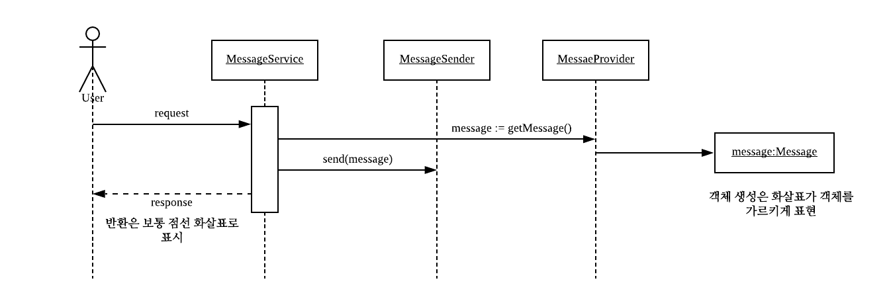
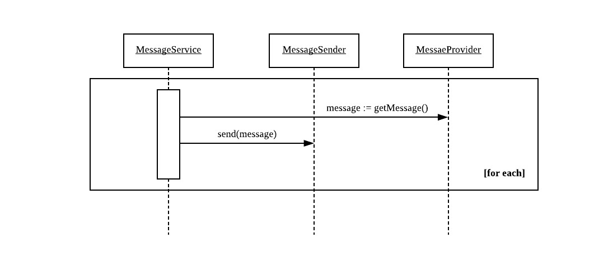
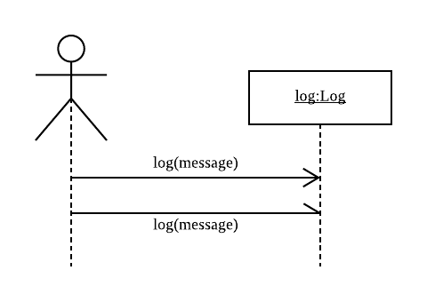

# UML 실전에서는 이것만 쓴다

### 왜 모델을 만들어야 하는가?
- 어떤 것이 실제로도 잘 동작하는지 알아보기 위해 만드는 것이 모델이다.

### UML을 사용해야할 때?
- 시험해볼 구체적인 것이 있고 이를 코드로 시험하는 것 보다 UML로 시험하는 것이 **비용이 더 적을 때 UML을 사용한다.**

### UML을 효과적으로 사용하기
- 설계 개념에 대한 의견을 주고 받을 때 의사 소통하기 매우 편리함
    - 알고리즘과 같은 세부적인 내용은 UML에 적합하지 않다.
- 대규모 프로젝트의 로드맵을 만들 때 유용
    - 대규모 프로젝트의 구조를 한 눈에 파악할 수 있다.
- 다이어그램은 단순하고 깔끔하게 유지하자.

## 클래스 다이어그램
### 기본 개념
- -는 private, #는 protected, +는 public을 뜻함
    - 이런 세부적인 내용이 필요할 떄도 있으나 꼭 명시할 필욘 없다.(목적에 맞게 사용하자)
    
### 연관 스테레오타입
- 연관 표기에 스테레오 타입을 붙여 의미를 다양하게 표현할 수 있다.
- `<<create>>`는 연관 대상을 생성함을 나타냄 
- `<<local>>`는 로컬 변수로 연관관계를 맺고 있음을 나타냄
- `<<parameter>>`는 메서드 파라미터로 연관관계를 맺고 있음을 나타냄. (점선으로 표현하기도 함)
- `<<delegate>>`는 연관 대상에게 요청을 위임하는 경우
 
## 시퀀스 다이어그램
- 동적 모델 가운데 UML 사용자가 가장 많이 사용하는 다이어그램
- 어떤 객체 그룹들이 어떻게 협력하는지 누군가에게 바로 설명해야할 떄, 그 협력을 시각화해서 보고 싶을 때 유용하다.

### 기본적인 시퀀스 다이어그램 예시

- 객체는 보통 이름 아래 밑줄로 표시한다. (밑줄이 없다면 클래스)
- 얇은 사각형은 활성 상자로, 어떤 함수가 실행되는 시간을 나타낸다.

### 반복을 표현할 수 있는 시퀀스 다이어그램 예시

- 상자로 감싼 후 오른쪽 하단에 알고리즘 세부사항을 설명

### 시퀀스 다이어그램 그릴 때 고려할 점
- 절대 모든 시나리오를 전부 그리지마라. 어차피 읽지 않는다.
- **모든 시나리오에서 공통으로 나오는 것들에 초점을 맞추자.**
    - 고차원 모듈이 공통점을 나타내므로 고차원이 저차원보다 더 유용하다.
- 코드로 의사 전달이 더 효율적이라면 다이어그램은 시간 낭비다.
- 시퀀스 다이어그램은 나눌 수 있을 만큼 나눠서 표현하자.
 
### 비동기 메시지

- 보통 끝이 채워지지 않은 화살표를 사용한다.

## 유스케이스
- 유스케이스는 `단순하게 유지하는 것`이 가장 제대로 사용하는 것
- 모든 유스케이스를 포착하려고 하지말자. 어차피 불가능하다.
    - 내일이면 다 바뀌므로 오늘 세부사항까지 포착하지 말자.
    - 실제 구현이 가까워질 때 정리하자.
- 유스케이스는 다이어그램이 아니다. `특정 관점에서 보는 시스템의 동작을 기술한 것이다.`
    - 유스케이스는 글로만 정리하여도 충분히 표현이 가능

## 객체지향 개발의 원칙
- 잘 설계된 시스템은 `이해하기 쉽고, 바꾸기 쉽고, 쉽게 재사용 가능하다.`

### 나쁜 설계의 냄새
- 결합도가 높아 변경의 영향이 큼
- 재사용하기 어려움
- 쓸데없이 복잡한 코드가 많음(언젠간 유용할거라고 생각하고 현 상황에 맞지 않게 복잡하게 만듬)
- 반복이 넘쳐남

> UML 다이어그램을 잘 활용하면 나쁜 설계의 냄새를 없애는데 도움이 많이 된다.

### SOLID
- 객체지향 5원칙은 좋은 설계를 만드는데 유용한 원칙들을 제공해준다.

#### 단일 책임 원칙
- 클래스의 변경이 오직 하나의 이유에서만 필요하다록 만들자.
- UML 클래스 다이어그램을 그려보면 이를 파악하는데 도움이 된다.
- 이 원칙을 지키면 코드 변경의 영향도를 줄일 수 있고 시스템을 단순하게 유지시킬 수 있다.

#### 개방 폐쇄 원칙
- 엔티티(모듈, 클래스, 함수) 확장에 대해선 열려있지만, 변경에 대해선 닫혀있어야 한다.
- 인터페이스에 의존하도록하고 의존성 주입을 이용하면 가장 쉽게 이를 지킬 수 있다.
- 이 원칙을 지키면 기존 코드의 변경 없이 확장이 가능하다.

#### 리스코프 치환 원칙
- 하위 타입은 언제나 상위 타입을 대체할 수 있어야 한다.
- 클라이언트 입장에서 시용하는 타입의 하위 타입이 오더라도 명시적 타입 변환을 할 필요 없이 그대로 사용할 수 있어야 한다.
- 리스코프 치환 원칙의 핵심은 요구 사항에 따라 클라이언트가 예상하는 결과를 반드시 하위 타입도 동일하게 낼 수 있어야 한다.(내 생각)
    - **구현체가 오버라이드 메서드에 아무 로직을 넣지 않거나 사용하지 못하도록 예외를 넣는다면 이는 상위 타입을 대체할 수 없다.**
    - 이는 리스코프 치환 원칙을 어기게 되고 결국 하위 타입들을 명시적으로 타입변환하여 분기가 필요해진다.

#### 의존 관계 역전 원칙
- 고차원 모듈은 저차원 모듈에 의존하면 안된다. 이 둘 모두 추상화된 것에 의존해야 한다.
- 추상화된 것이 구체적인 것에 의존하면 안된다. 구체적인 것이 추상화된 것에 의존해야 한다.
    - 추상 클래스나 인터페이스가 구현체인 클래스에 의존하지 않게 하자.
- 추상적인 것이 변경이 적기 때문에 추상적인 것에 의존하는 건 변경의 영향을 줄일 수 있다.

> 시스템을 안정적으로 만드는 것이 목적이다. JDK나 라이브러리 클래스들(변경될 일이 거의 없는 대상)은 이러한 원칙을 지킬 필요가 없다.

#### 인터페이스 분리 원칙
- 클라이언트는 자신이 사용하지 않는 메서드에 의존하지 않아야 한다.
- 클라이언트가 의존하고 있는 클래스의 메서드가 수십개가 존재하지만 2~3개만 사용한다면 다른 메서드 변경에도 클라이언트는 영향을 받을 수 있다.
- 클라이언트에게 필요한 메서드만 제공할 수 있도록 인터페이스를 분리하여 변경의 영향을 줄이자.

### 정답은 없다. 요구 사항과 현 상황에 맞춰 유연하게 원칙을 지키자.
- SOLID 원칙을 지킨답시고 모든 클래스를 인터페이스로 만들고, 변경의 이유를 하나만 가지게 하기 위해 하루종일 거기에 매달려 있는건 효율적이지 못하다.
- 이 원칙들은 적극적으로 적용하는 것이 아니라 코드에 구조적인 문제가 발생하였을 때 이 원칙들을 이용하여 해당 문제를 해결할 수 있도록 하자.

> 코드에 구조적인 문제를 재빨리 포착하기 위해선 단위 테스트가 유용하다. 

## 실천 방법: dX
- dx의 실천 방법 중 핵심은 `모든 것`을 `짧은 주기`로 반복하는 것이다.

### 반복 주기(iteration)에서 현재 주기에만 집중하자
- 다음 주기에 선택될지도 모르는 다른 스토리들을 고려하지 않는다.
- 현재시점에 가장 중요한건 현재 주기의 스토리이기 때문에 오직 현재 주기의 스토리들만 고려하여 설계하고 구현한다.

## 패키지
- 자바 컴파일 시스템은 소스코드의 패키지 구조를 본떠 만든 디렉터리 구조 안에 생성한 .class를 보관한다.

### 패키지 설계의 원칙
- 원칙은 반드시 지켜야하는건 아니지만 규모가 큰 애플리케이션에서 이 원칙들은 많은 도움이 된다.
- 1) 패키지 릴리즈/재사용 등가 원칙
    - 재사용할 때 같이 몰려다니는 클래슫르은 한 패키지로 묶어서 관리하자.
- 2) 공통 폐쇄 원칙
    - 단일 책임 원칙을 패키지로 확장한 것으로 패키지는 똑같은 종류의 변화에 폐쇄되어야 한다.
- 3) 공통 재사용 법칙
    - 한 클라이언트가 사용하는 클래스들과 다른 클라이언트가 사용하는 클래들을 최대한 분리한다.
    - 서로 다른 클라이언트가 의존하는 클래스들이 한 패키지에 섞여 있으면 한 클라리언트의 변경이 다른 클라이언트에게 영향을 줄 수 있다.
- 4) 의존 관계 비순환 원칙
    - 패키지의 의존에 순환이 있으면 안된다.
- 5) 안정된 의존 관계 원칙
    - 자신을 의존하는 대상들이 많아 바꾸기 어려운 패키지는 바뀌기 쉬운 패키지에 의존하면 안된다.
    - 이로 인해 바뀌기 쉬운 패키지도 바뀌기 어렵게 된다.
- 6) 안정된 추상화 원칙
    - 안정된 패키지는 확장이 가능하도록 추상도를 높여야 한다.
    - 외부에 들어오는 의존이 많아 바꾸기 어려운 안정된 패키지에 추상 클래스나 인터페이스를 두어 추상도를 높일 수 있다. 
